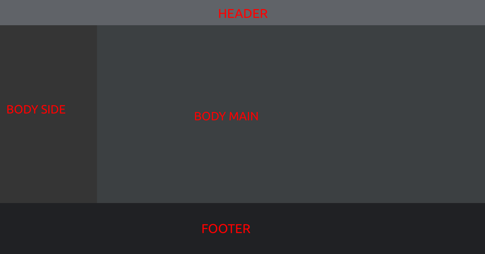
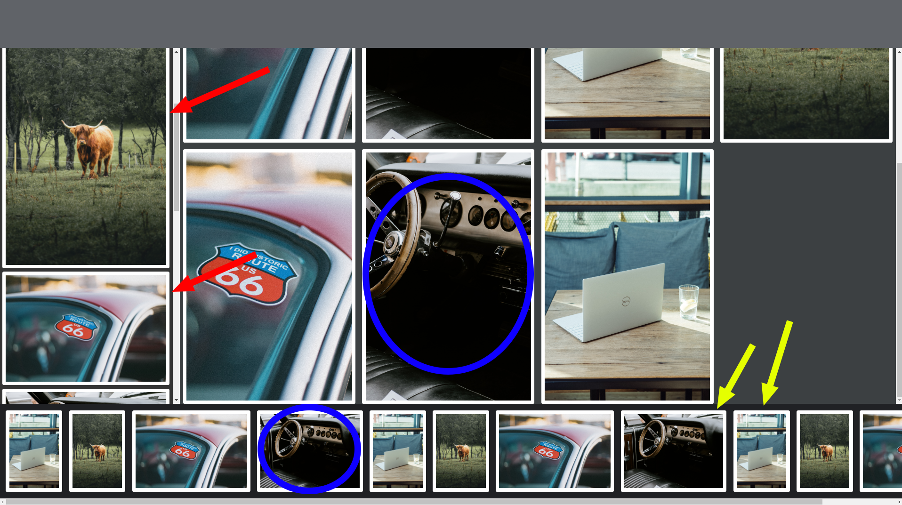

## Challange 01
Html ve Css öncelikli sayfa tasarımı.

- Sayfayı yatay 3 parçadan oluşmalı. (<span style="color:red">Kırmızı kural</span>)
- parçalara sırasıyla `header`, `body`, `footer` classları verilmeli. (<span style="color:red">Kırmızı kural</span>)
- sayfanın yükseklik değerinin %10'u kadar `header`, %70'i `body`, %20'si `footer`'a verilmeli. (<span style="color:red">Kırmızı kural</span>)
- Body kendi içinde dikey olarak 2 parçadan oluşmalı. `body-side` %20, `body-main` %80'i kaplamalı. Not: body-side minimum 250px olmalı. (<span style="color:red">Kırmızı kural</span>)


Aşağıda örnek css değerleri verilmiştir. buradaki css selektörlerinin içleri sadece bu değerler ile sınırlı değildir. extra özellikler ekleyebilirsiniz
```css
.header {
    background-color: #606368;
    ...
}
.body-side {
    background-color: #353535;
    ...
}
.body-main {
    background-color: #3c4042;
    ...
}
.footer {
    background-color: #202124;
    ...
}
.card {
    margin: 8px;
    padding: 8px;
    border-radius: 4px;
    background-color: #ffffff;
    ...
}
```

## Resimler ve boyutlandırmalarından beklediklerimiz
Aşağıdaki resim üzerinden anlatmaya çalışalım.

- Kırmızı ok ile çizdiğimiz resimlerin aspect-ratio (en/boy) oranı bozulmaksızın çizilmiştir. Resim dikey bir resim ise daha uzun, yatay bir resim ise daha kısa gözükmeli. Resimin genişlik değerleri aynı olacak şekilde ayarlanmalı. (<span style="color:yellow">SARI kural</span>)

- Sarı ok ile çizdiğimiz resimlerin aspect-ratio (en/boy) oranı bozulmaksızın çizilmiştir. Resimlerin yükseklik değerleri aynı olacak ayarlanmalı. (<span style="color:yellow">SARI kural</span>)

- Mavi daire ile işaretlenmiş yerlerde 2 tane aynı resim bulunmaktadır. `footer`'da bulunan resimde aspect/ratio değeri oynanmadığı için resimin tamamı sıkıştırılarak ayarlanmıştır. `body-main` içerisindeki resimde direksiyonun bir kısmının gözükmediğini fark edeceksiniz. `body-main` içerisindeki tüm resimlerin boyları aynı olmalıdır. aspect/ratio oranını bozmamak için resimlerin orta bölümleri gözükecek şekilde ayarlanmalı. (<span style="color:yellow">SARI kural</span>)



## <span style="color:red">Diğer Kırmızı Kurallar</span>
- sayfa boyutları statik pixel değerleri verilmemeli.
- scrollbarlar gerektiğinde gözükmeli.
- hiç bir resimde ve/veya parent cardlarda taşmalar olmamalı
- body-side'ın scrollbar'ı kendisinin dışına taşmamalı
- body-main'in scrollbar'ı kendisinin dışına taşmamalı
- footer'ın scrollbar'ı kendisinin dışına taşmamalı ve yatay olmalı
- resimler kartların dışına taşmamalı
- uygulamanın hiç bir yerinde position değeri absolute ve/veya fixed olmamalı.
- Verilen resimlerin dışında başka bir resim kullanılmamalı. Resimleri [buradan](assets/resimler.zip) indirebilirsiniz
- display değeri flex veya grid olmalı.
- her bir resim bir `card` içerisinde olmalı. yukarıda css ile bazı bilgileri verilmiştir.


## Extralar
- `body-main` display grid ile kullanılmalı. yan yana 4 resim olmalı
- `body-main`, `body-side`, `footer` divlerinin içine position değeri absolute olan ilgili div'in sağ üst köşesine bir buton eklenmeli. Bu butona tıklanıldığında bulunduğu div'e yeni bir resim `card` oluşturmalısınız.


## Sonunda olmasını beklediğimiz uygulama

