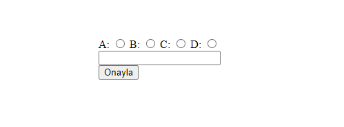

# HTML ve HTML 5

## Öncelikli HTML Elementleri
- Tüm HTML Element Reference için [w3schoold tags](https://www.w3schools.com/tags/default.asp) üzerinden çalışabilir öğrenebilirsiniz.
- `div` `span` `hr` `br` `button`
- `table` elementi ve çocukları. `tbody` `tr` `th` `td`
- inputların kullanımına extra özellik katan `label` kaç farklı şekilde yazılır, input'a nasıl bir özellik katar.
- sık kullanılan inputlar
    - `<input type="button">`
    - `<input type="checkbox">`
    - `<input type="color">`
    - `<input type="date">`
    - `<input type="datetime-local">`
    - `<input type="email">`
    - `<input type="file">`
    - `<input type="hidden">`
    - `<input type="number">`
    - `<input type="password">`
    - `<input type="radio">`
    - `<input type="range">`
    - `<input type="submit">`
    - `<input type="text">`
    - `<input type="url">`
- Daha detaylı inputları için [w3school sitesinden](https://www.w3schools.com/html/html_form_input_types.asp) bakabilirsiniz.
---
# Sorular
- div ile span arasında ne fark vardır.
- italik, kalın, altı yazı için hangi element kullanılmalı.
- Çok satırlı yazı yazmak için hangi element kullanılmalı.
- Render edilmeyen bir elementi yazmak için hangi element kullanılmalı. Bir div'in içine nasıl `<button>Merhaba Dünya</button>` yazılır.
- Başka sayfaya nasıl link veririlir. Açılan sayfayı aynı yeni sekmede açılır.
- base elementi ne için kullanılır ne işe yarar.
- Nasıl iki tane radio button grupu yapılır 

    
- `form` elementi ne için kullanılır. 
- Bir `form` elementi içerisinde nasıl zorunlu alan yapılır.

    

